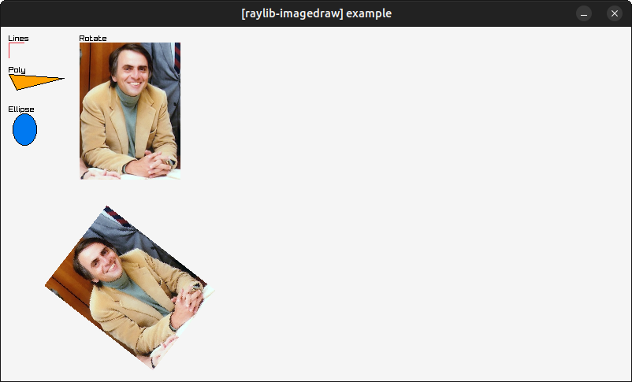

# raylib-imagedraw

Extra image manipulation software rendering library functionality for raylib.

[](examples/raylib-imagedraw-example.c)

## Usage

``` c
#include "raylib.h"

#define RAYLIB_IMAGEDRAW_IMPLEMENTATION
#include "raylib-imagedraw.h"

int main() {
    const int screenWidth = 800;
    const int screenHeight = 450;
    InitWindow(screenWidth, screenHeight, "[raylib-imagedraw] example");
    Image screen = GenImageColor(screenWidth, screenHeight, RAYWHITE);

    Vector2 points[3] = {
        {10, 60},
        {80, 65},
        {20, 80}
    };
    ImageDrawPoly(&screen, points, 3, ORANGE);
    ImageDrawPolyLines(&screen, points, 3, BLACK);

    while (!WindowShouldClose()) {
        BeginDrawing();
        {
            ClearBackground(RAYWHITE);
            DrawImage(screen);
        }
        EndDrawing();
    }

    UnloadImage(screen);
    CloseWindow();

    return 0;
}
```

## API

``` c
void ImageDrawLineHorizontal(Image* dst, int posX, int posY, int width, Color color);
void ImageDrawLineVertical(Image* dst, int posX, int posY, int height, Color color);
void ImageDrawPoly(Image* dst, Vector2* points, int pointCount, Color color);
void ImageDrawPolyLines(Image* dst, Vector2* points, int pointCount, Color color);
void ImageDrawEllipse(Image* dst, int centerX, int centerY, int radiusX, int radiusY, Color color);
void ImageDrawEllipseLines(Image* dst, int centerX, int centerY, int radiusX, int radiusY, Color color);
void ImageDrawImage(Image* dst, Image src, int posX, int posY, Color tint);
Image ImageRotate(Image src, float radians);
void DrawImage(Image image, int posX, int posY);
```

## License

*raylib-imagedraw* is licensed under an unmodified zlib/libpng license, which is an OSI-certified, BSD-like license that allows static linking with closed source software. Check [LICENSE](LICENSE) for further details.
